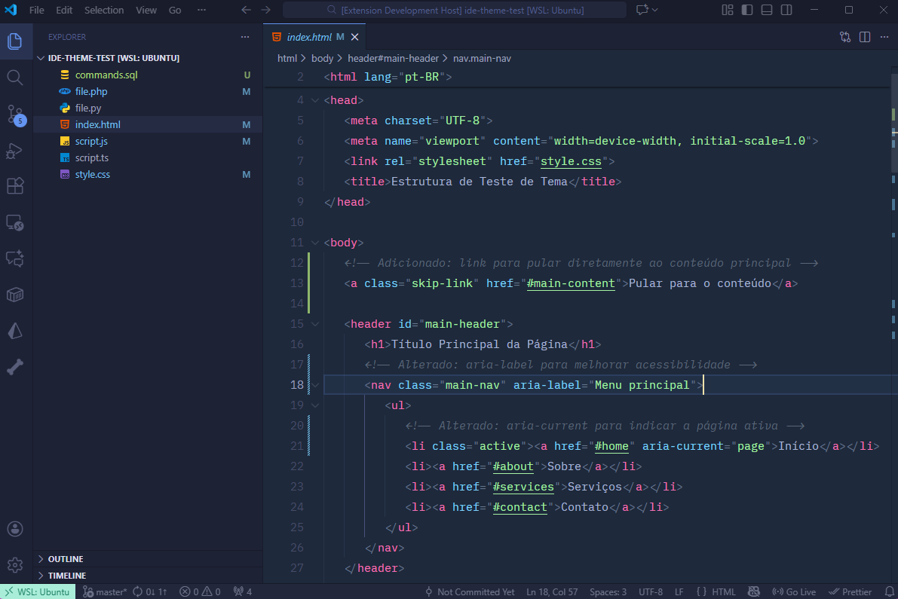
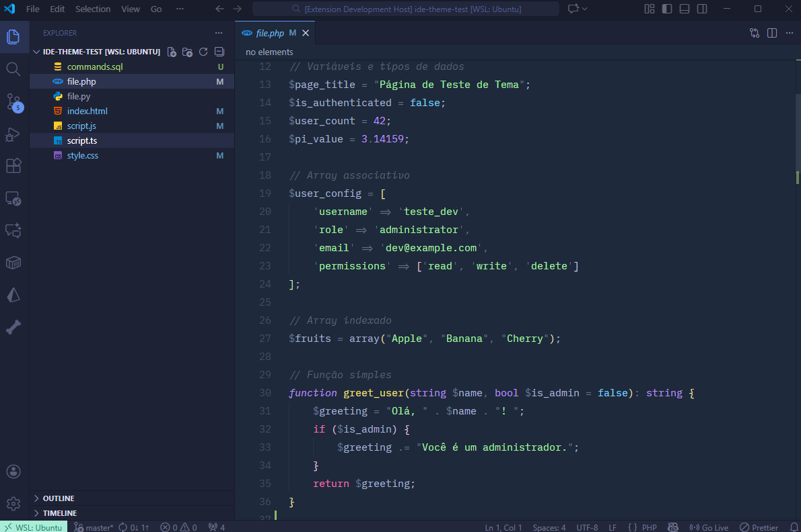
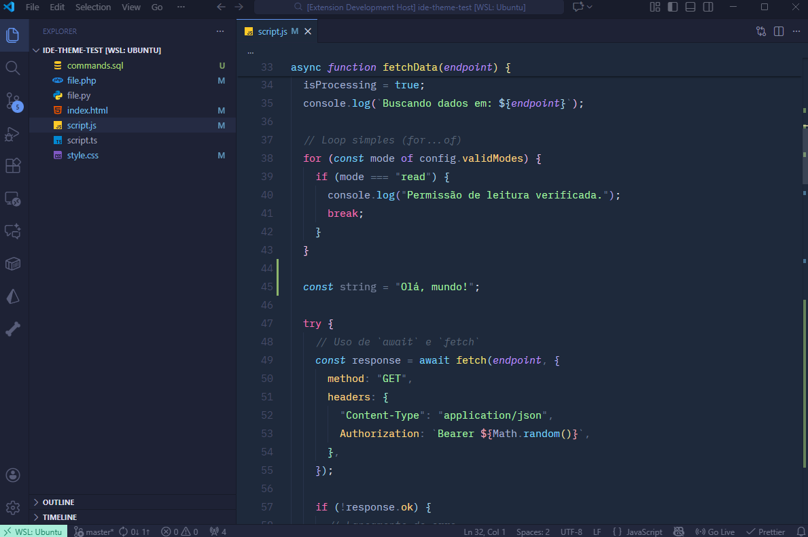

# Lollipop Theme

This is a color theme that brings together characteristics of some themes I like. I based it mainly on the Code Highlight shown on the Tailwind CSS homepage, but I was also inspired by the [Halcyon Theme](https://marketplace.visualstudio.com/items?itemName=brittanychiang.halcyon-vscode) and the [Bearded Theme](https://marketplace.visualstudio.com/items?itemName=BeardedBear.beardedtheme) for the interface.

### Recommendations

- [Lilex](https://lilex.myrt.co/) or [IBM Plex Mono](https://fonts.google.com/specimen/IBM+Plex+Mono) for typography
- Icon theme: [Material Icon Theme](https://marketplace.visualstudio.com/items?itemName=PKief.material-icon-theme)

**Typography Settings for settings.json**

```json
{
  "editor.fontSize": 15,
  "editor.lineHeight": 1.8
}
```





### Notes

- The theme is currently under development and has not yet been published on the Visual Studio Code Marketplace
- If you want to use the theme, add it to the ".vscode/extensions" folder

---

# Lollipop Theme

Este é um tema de cores que reune características de alguns temas que gosto. Me baseei principalmente no Highlight Code exibido na página inicial do Tailwind CSS, mas também tive inspiração no [Halcyon Theme](https://marketplace.visualstudio.com/items?itemName=brittanychiang.halcyon-vscode) e no [Bearded Theme](https://marketplace.visualstudio.com/items?itemName=BeardedBear.beardedtheme) para a interface.

### Recomendações

- [Lilex](https://lilex.myrt.co/) ou [IBM Plex Mono](https://fonts.google.com/specimen/IBM+Plex+Mono) para tipografia
- Tema de ícones: [Material Icon Theme](https://marketplace.visualstudio.com/items?itemName=PKief.material-icon-theme)

**Configs. de Tipografia para settings.json**

```json
{
  "editor.fontSize": 15,
  "editor.lineHeight": 1.8
}
```

### Observações

- O tema encontra-se em fase de desenvolvimento e ainda não foi publicado no Marketplace do Visual Studio Code
- Caso deseje usar o tema, adiciona-lo na pasa ".vscode/extensions"
